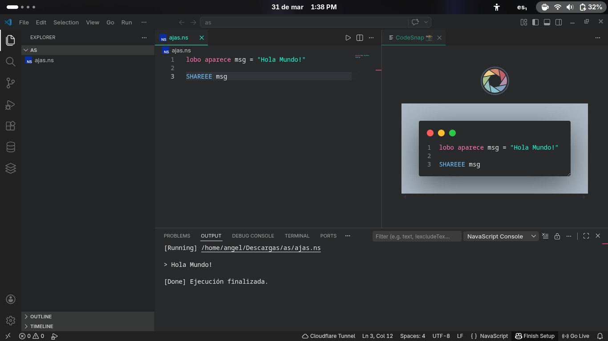
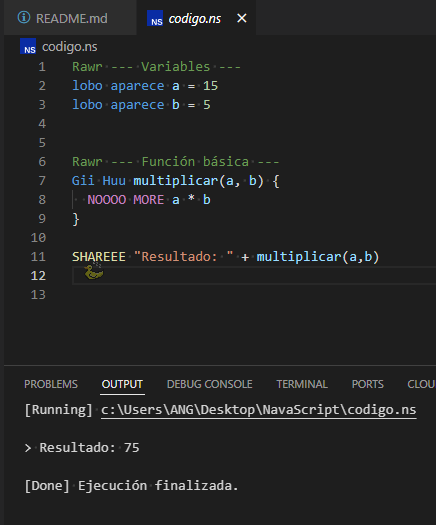
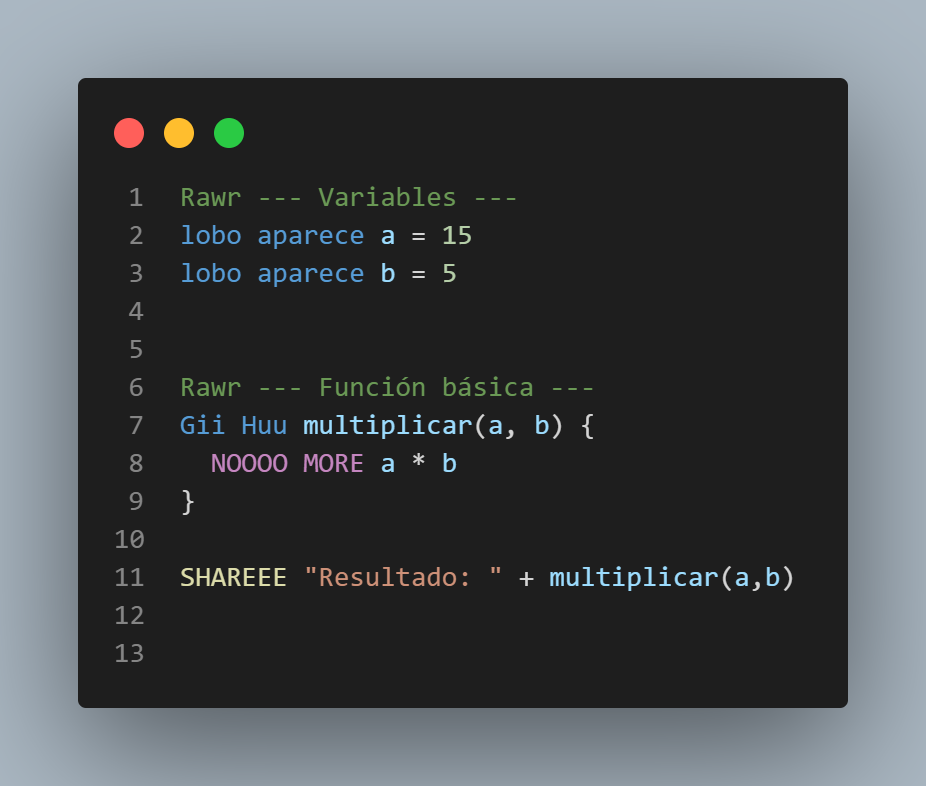
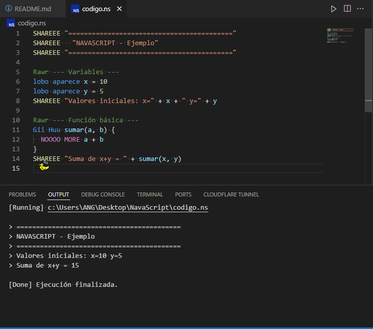
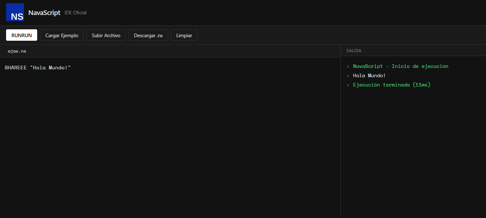
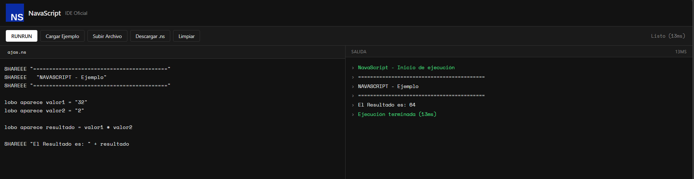

# NavaScript

> Un lenguaje de programación interpretado con sintaxis propia, IDE web, extensión para VS Code e intérprete CLI.

[](https://opensource.org/licenses/MIT)
[](https://marketplace.visualstudio.com)
[](https://AngelDev2343.github.io)
[](https://github.com/AngelDev2343)

---

## Tabla de Contenidos

- [Descripción general](#descripción-general)
- [Capturas de pantalla](#capturas-de-pantalla)
- [Componentes](#componentes)
- [Referencia de sintaxis](#referencia-de-sintaxis)
- [Ejemplos de código](#ejemplos-de-código)
- [Cómo empezar](#cómo-empezar)
- [Licencia](#licencia)

---

## Descripción general

**NavaScript** (`.ns`) es un lenguaje de programación interpretado construido desde cero. Cuenta con su propia sintaxis, un intérprete completamente funcional en el navegador, un IDE web dedicado, una extensión para VS Code con resaltado de sintaxis, y un intérprete CLI independiente.

El lenguaje soporta variables, funciones, condicionales, bucles, recursión y evaluación de expresiones — todo a través de un conjunto de palabras clave único.

---

## Capturas de pantalla







---

## Componentes

### 1. IDE Web

Un entorno de desarrollo completamente basado en el navegador, disponible en **[NavaScript IDE Oficial](https://AngelDev2343.github.io/NavaScript)**.

**Características:**
- Editor de código con soporte para archivos `.ns`
- Intérprete integrado — se ejecuta completamente en el navegador, sin servidor
- Panel de salida en tiempo real con tiempo de ejecución
- Carga y descarga de archivos `.ns` desde el disco
- Panel de referencia rápida de sintaxis integrado
- Atajo de teclado: `Ctrl+Enter` / `Cmd+Enter` para ejecutar

No requiere instalación. Abre la URL y empieza a escribir código.

---

### 2. Extensión para VS Code

Una extensión de Visual Studio Code que agrega soporte completo para el lenguaje NavaScript.

**Características:**
- Resaltado de sintaxis para todas las palabras clave de NavaScript
- Ejecutor integrado (comando `NS: Ejecutar RUNRUN`)
- Panel de consola de salida dedicado
- Soporte completo para archivos `.ns`

**Estado:** Actualmente en revisión en el Marketplace de VS Code.

**Instalación manual (mientras está en revisión):**

* Desde VS Code: `Extensiones` → `···` → `Instalar desde VSIX...` → selecciona el archivo `.vsix`.

---

## Referencia de sintaxis

NavaScript usa un conjunto fijo de palabras clave con distinción entre mayúsculas y minúsculas. Todas las palabras clave deben escribirse exactamente como se muestra.

### Variables

```ns
lobo aparece x = 10
lobo aparece nombre = "NavaScript"
lobo aparece activo = true
```

Declara e inicializa una variable. Las variables son de tipado dinámico. La reasignación se hace con `=` simple:

```ns
x = 20
```

---

### Salida

```ns
SHAREEE "Hola mundo"
SHAREEE x
SHAREEE "Valor: " + x
```

Imprime un valor en la consola de salida. Soporta concatenación de cadenas con `+`.

---

### Comentarios

```ns
Rawr Esto es un comentario
Rawr --- Sección de inicialización ---
```

`Rawr` marca el resto de la línea como comentario. El intérprete lo ignora completamente.

---

### Funciones

```ns
Gii Huu nombreFuncion(param1, param2) {
  NOOOO MORE param1 + param2
}
```

- `Gii Huu` declara una función.
- Los parámetros se separan con comas.
- `NOOOO MORE` retorna un valor desde la función.
- Las funciones se pre-escanean antes de la ejecución, por lo que el orden de declaración no importa.

**Llamar una función:**

```ns
lobo aparece resultado = nombreFuncion(5, 3)
SHAREEE resultado
```

La recursión está soportada hasta una profundidad de 200 llamadas.

---

### Condicionales

```ns
si x > 5 {
  SHAREEE "Mayor que 5"
}
sino {
  SHAREEE "Menor o igual a 5"
}
```

- `si` evalúa la condición. Si es verdadera, ejecuta el bloque.
- `sino` es la rama else opcional.
- Operadores soportados: `>`, `<`, `>=`, `<=`, `==`, `!=`

---

### Bucles

**Bucle while (`mientras`)** — se ejecuta mientras la condición sea verdadera:

```ns
mientras x > 0 {
  SHAREEE x
  Boom x
}
```

**Bucle while invertido (`Grr`)** — se ejecuta mientras la condición sea **falsa** (es decir, hasta que la condición se vuelva verdadera):

```ns
Grr x == 0 {
  SHAREEE x
  Boom x
}
```

Ambos bucles tienen un límite máximo de 10,000 iteraciones para prevenir bucles infinitos.

---

### Incremento / Decremento

```ns
Zap x    Rawr x = x + 1
Boom x   Rawr x = x - 1
```

`Zap` incrementa una variable en 1. `Boom` la decrementa en 1. La variable debe estar declarada previamente.

---

### Pausa

```ns
Uuh 1000
```

Pausa la ejecución durante el número de milisegundos indicado. Útil para lógica basada en tiempo.

---

### Operadores

| Tipo        | Operadores                          |
|-------------|-------------------------------------|
| Aritméticos | `+`, `-`, `*`, `/`, `%`             |
| Comparación | `==`, `!=`, `>`, `<`, `>=`, `<=`    |
| Cadenas     | `+` (concatenación)                 |

---

### Límites del intérprete

| Parámetro                       | Valor   |
|---------------------------------|---------|
| Profundidad máxima de recursión | 200     |
| Iteraciones máximas por bucle   | 10,000  |
| Instrucciones totales máximas   | 100,000 |

Superar cualquiera de estos límites lanza un error en tiempo de ejecución.

---

## Ejemplos de código

### Hola Mundo

```ns
SHAREEE "Hola mundo"
```

---

### Variables y aritmética

```ns
lobo aparece x = 10
lobo aparece y = 3
lobo aparece suma = x + y
SHAREEE "Suma: " + suma
SHAREEE "Módulo: " + x % y
```

---

### Función con valor de retorno

```ns
Gii Huu potencia(base, exp) {
  lobo aparece resultado = 1
  lobo aparece i = 0
  mientras i < exp {
    resultado = resultado * base
    Zap i
  }
  NOOOO MORE resultado
}

SHAREEE potencia(2, 8)
```

---

### Lógica condicional

```ns
lobo aparece edad = 18

si edad >= 18 {
  SHAREEE "Mayor de edad"
}
sino {
  SHAREEE "Menor de edad"
}
```

---

### Cuenta regresiva con bucle

```ns
lobo aparece n = 5
mientras n > 0 {
  SHAREEE n
  Boom n
  Uuh 500
}
SHAREEE "Despegue"
```

---

### Función recursiva (Fibonacci)

```ns
Gii Huu fib(n) {
  si n <= 1 {
    NOOOO MORE n
  }
  NOOOO MORE fib(n - 1) + fib(n - 2)
}

SHAREEE fib(10)
```

---

## Cómo empezar

### Opción A — IDE Web (sin instalación)

Ve a **[NavaScript IDE Oficial](https://AngelDev2343.github.io/NavaScript)**, escribe tu código y presiona `RUNRUN` o `Ctrl+Enter`.

---

### Opción B — Extensión para VS Code

1. Descarga el archivo `.vsix` desde la página de [Releases](https://github.com/AngelDev2343/navascript/releases).
2. Abre VS Code.
3. Ve a `Extensiones` → `···` → `Instalar desde VSIX...`.
4. Selecciona el archivo descargado.
5. Crea un archivo con extensión `.ns` y empieza a programar.

---

## Licencia

Este proyecto está bajo la **Licencia MIT**.  
Consulta el archivo [LICENSE](./LICENSE) para más detalles.

---

<p align="center">
  Desarrollado por <a href="https://github.com/AngelDev2343">AngelDev2343</a>
</p>